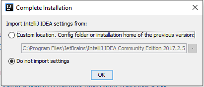
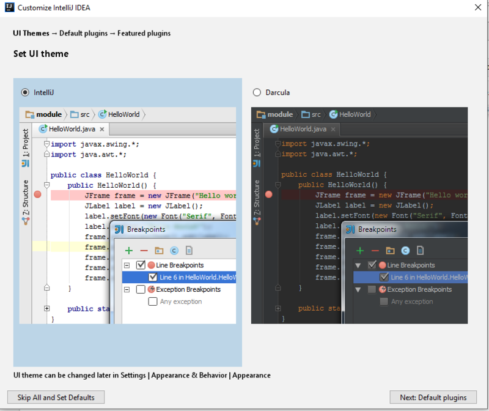
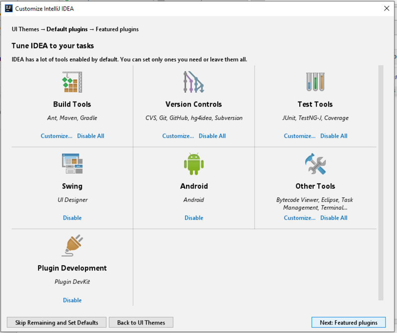
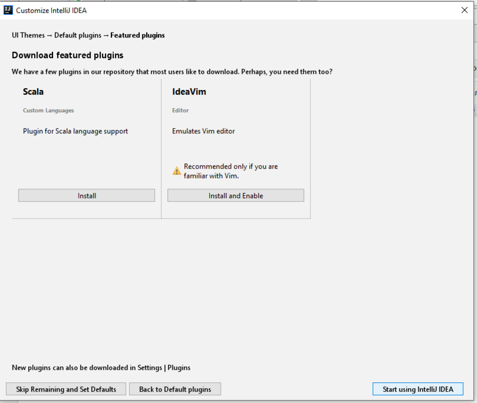
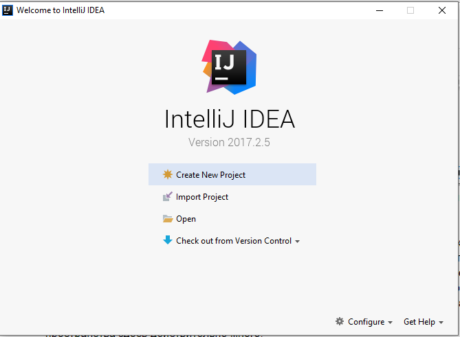

# Первая программа на Java
1. [Структура программы](#Структура-программы)
    1. [Область подключения внешних пакетов](#Область-подключения-внешних-пакетов)
    2. [Область написания кода](#Область-написания-кода)
2. [Первая программа](#Первая-программа)
3. [IntelliJ IDEA](#intellij-idea)
    1. [Установка](#Установка)
    2. [Настройка](#Настройка)
    3. [Первый проект в IntelliJ IDEA](#Первый-проект-в-intellij-idea)


## Структура программы
Для того, чтобы создать простое приложение на Java необходим текстовый редактор для набора кода программы, например:

- `Vi`/`Vim`/`Nano` (for `UNIX-like OS`)
- `Notepad` (for `Windows`)

> Microsoft Word - это не текстовый редактор, а текстовый процессор

Рассмотрим пример простой программы на `Java`:

```java
import java.io.Console; // подключение используемых в программе внешних пакетов

public class Program { // объявление нового класса
    public static void main (String args[]) { // объявление нового метода
        String name; // переменная для имени
        Console con = System.console(); // получаем объект консоли для считывания с консоли
        name = con.readLine("Введите свое имя: "); // считываем введенное значение
        System.out.println("Добро пожаловать, " + name); // ввыводим данную запись поток вывода
    } // конец объявления нового метода
} // конец объявления нового класса
```

### Область подключения внешних пакетов
В начале файла идет секция с подключенными внешними пакетами с помощью директивы `import`, после которой идут названия подключаемых пакетов и классов. Пакеты представляют собой организацию классов и интерфейсов в общие группы или блоки.

### Область написания кода
И так как язык `Java` имеет `С`-подобный синтаксис:

- Каждая строка завершается точкой с запятой, а каждый блок кода помещается в фигурные скобки.
- Далее идет определение класса программа. Классы объявляются следующим способом:
    - идет модификатор доступа `public`, который указывает, что данный класс будет доступен всем, то есть его можно запустить из командной строки.
    - далее идет ключевое слово `class`
    - название класса
    - блок самого класса в фигурных скобках.

Классы являются теми кирпичиками, из которых состоит программа на `Java`. Особо следует остановиться на именах классов. **Имена классов**, а также **их методов и переменных**, еще **называют идентификаторами**. **Идентификаторы** представляют произвольную последовательность алфавитных и цифровых символов, а также символа подчеркивания, однако при этом:
- *названия не должны начинаться с цифры*.
- *не должны представлять зарезервированные ключевые слова*, например, такие как `class` или `int` и т.д.

Класс может содержать различные переменные и методы. В данном случае у нас объявлен один метод `main`. Как и в многих других `C`-подобных языках в программе на `Java` метод `main` является *входной точкой программы*, с него начинается все управление. Он обязательно должен присутствовать в программе.

Метод `main` также имеет модификатор `public`. Слово `static` указывает, что метод `main` — **статический**, а слово `void` — что он не возвращает никакого значения.

Далее в скобках идут параметры метода — `String args[]` — это массив `args`, который хранит значения типа `String`, то есть строки. В данном случае они пока не нужны, но в реальной программе это те строковые параметры, которые передаются при запуске программы из командной строки.

Блок метода `main` содержит код программы. Вначале объявляется переменная `name`, которая будет хранить строку, то есть объект типа `String`: `String name`. **Java**, как и другие **С**-подобные языки, является **регистрозависимым**, поэтому следующие два объявления целочисленных переменных `String name` и `String Name` будут обозначать две разных переменных.

Далее идет создание переменной консоли, которая позволит взаимодействовать с консолью: `Console con = System.console();`. Так как класс `Console` находится в библиотеке классов в пакете `java.io`, то в начале файла подключается этот класс директивой импорта `import java.io.Console`

Затем с помощью метода `con.readLine` выводится приглашение к вводу имени и ожидается, пока пользователь не введет имя. Так как данный метод возвращает введенное пользователем значение, то его можно присвоить переменной `name`.

И в конце введенное имя выводится на экран с помощью класса `System` и метода `println`. Хотя `System`, как и `Scanner`, является классом, размещенном в одном из пакетов, но его не нужно подключать с помощью директивы импорта. Так как `System` находится в пакете `java.lang`, все классы которого автоматически подключаются в программу.

Кроме собственно кода программы здесь использованы пояснения к коду или комментарии. Для создания однострочного комментария используется двойной слеш `//`. При компиляции программы все комментарии игнорируются и служат лишь для пояснения действий программисту.


## Первая программа
Процесс создания программы можно разделить на три этапа:
1. написание
2. компиляция
3. запуск

### Написание
Для написания используется текстовый редактор или **IDE** (*integrated development environment*).

```java
public class HellToWorld {
    public static void main (String args[]) {
        System.out.println("Hell to World!");
    }
}
```
Сохранить программу в файл под названием `HellToWorld.java`, где `java` — расширение файла, так как файл, содержащий `public class` должен называться так же, как и сам класс — в нашем случае `HellToWorld`.

> Следующие шаги в `OS Windows` не сработают, так как нужно [добавить путь к *JDK* в переменную *PATH* в переменных среды](https://www.java.com/ru/download/help/path.xml)

### Компиляция
После написания нужно скомпилировать программу, т.е. преобразовать `Java`-код в `byte`-код, с которым может работать `JVM`. Откроем `terminal` в `Linux`/`MacOS` (или командную строку в `Windows`) и с ее помощью сделаем следующие шаги:
- перейти в `directory`, где лежит наш файл с программой с помощью команды `cd путь_к_файлу`
- скомпилировать программу, с помощью команды `javac HellToWorld.java`
- проверить наличие скомпилированной программы в `directory`, с помощью команды `dir` можно убедиться в наличии `HellToWorld.class` - скомпилированная программа

### Запуск
После компиляции программа запускается с помощью команды `java HellToWorld`. После запуска в `terminal` отобразится текст, который выводится в данной программею.


## IntelliJ IDEA
**IntelliJ IDEA** – одна из самых мощных универсальных сред разработки. Она поддерживает такие языки, как *PHP*, *JavaScript*, *Sass*, *Ruby*, *Python* и конечно же *Java*. Так же есть поддержка популярных фреймворков и движков, тестов для кода, адаптацию под мобильные устройства, интеграцию с *Git* и *Mercurial*, инструменты для работы с серверами.

Существует две версии **IntelliJ IDEA** – *Community* и *Unlimited*. Первая – бесплатная, но ограниченная. В ней не поддерживаются фреймворки *Spring*, *Vaadin*, *GWT*, языки *JavaScript* и *TypeScript*, *SQL* и многое другое. Вторая включает в себя всевозможные фичи для коллективной разработки, но бесплатна будет только 30 дней пробного периода.

### Установка
Для **Linux** необходимо распаковать *ideaIC.gz* в директорию, которая поддерживает выполнение файлов. Для иерархии формата *FHS* это */opt*. После этого необходимо перейти в сабдиректорию */bin* и запустить файл `idea.sh`.

В **MacOS** — двойной щелчок на файле *ideaIC.dmg*, монтировать архив и копировать исходники в папку *Applications*.

Для установки в ОС **Windows** необходимо скачать с [официального сайта](https://www.jetbrains.com) исходник с расширением *exe*.  Далее запускать его и следовать инструкциям установщика.

### Настройка
При первом запуске **IntelliJ IDEA** появится диалоговое окно с требованием указать путь до файла с настройками. Необходимо выбрать пункт *«Do not import settings»*. Если данное окно появилось после обновления или переустановки – выбрать исходную директорию.



Следующим шагом настройки **intellij idea** будет выбор темы. ПО умолчанию их две – *стандартная* (светлая) и *Darcula* (тёмная).



*IDEA* поддерживает огромное количество вспомогательных инструментов. Разумеется, новичку они все не нужны. Поэтому необходимо отключить их для увеличения производительности. Для этого в очередном диалоговом окне выбрать *«Disable All»*. Их можно подключить позднее в меню настроек.






### Первый проект в IntelliJ IDEA
После установки и настройки *IntelliJ IDEA*, можно приступить к работе. Для этого необходимо создать проект в *IntelliJ IDEA*.



Диалоговое окно предлагает варианты:
- создать новый проект (*Create New Project*)
- открыть существующий (*Open*)
- импортировать проект (*Import Project*) 
- выйти из системы контроля версий (*Check out from Version Control*)

Нужно выбрать первый пункт. Подробнее о том, как создать проект *IntelliJ IDEA*, что делать уже внутри среды, лучше почитать на [официальном сайте](https://www.jetbrains.com), потому что возможностей для кастомизации рабочего пространства здесь действительно много.