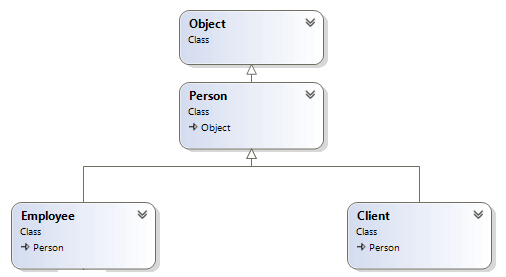

## Иерархия наследования и преобразование типов
Преобразование объектов классов происходит по-другому, чем с примитивными типами. Допустим, у нас есть следующая иерархия классов:
```java
public class Program {
    public static void main(String[] args) {
        Person tom = new Person("Tom");
        tom.display();
        Person sam = new Employee("Sam", "Oracle");
        sam.display();
        Person bob = new Client("Bob", "DeutscheBank", 3000);
        bob.display();
    }
}

class Person {
    private String name;

    public String getName() {
        return name;
    }

    public Person(String name) {
        this.name = name;
    }

    public void display() {
        System.out.printf("Person %s \n", name);
    }
}

class Employee extends Person {
    private String company;

    public Employee(String name, String company) {
        super(name);
        this.company = company;
    }

    public String getCompany() {
        return company;
    }

    public void display() {
        System.out.printf("Employee %s works in %s \n", super.getName(), company);
    }
}

class Client extends Person {
    private int sum; // Переменная для хранения суммы на счете
    private String bank;

    public Client(String name, String bank, int sum) {
        super(name);
        this.bank = bank;
        this.sum = sum;
    }

    public void display() {
        System.out.printf("Client %s has account in %s \n", super.getName(), bank);
    }

    public String getBank() {
        return bank;
    }

    public int getSum() {
        return sum;
    }
}
```

В этой иерархии классов можно проследить следующую цепь наследования: `Object` (все классы неявно наследуются от типа Object) -> `Person` -> `Employee`|`Client`.



### Преобразование типов в языке Java
Суперклассы обычно размещаются выше подклассов, поэтому на вершине наследования находится класс `Object`, а в самом низу `Employee` и `Client`.

Объект подкласса также представляет объект суперкласса. Поэтому в программе мы можем написать следующим образом:
```java
Object tom = new Person("Tom");
Object sam = new Employee("Sam", "Oracle");
Object kate = new Client("Kate", "DeutscheBank", 2000);
Person bob = new Client("Bob", "DeutscheBank", 3000);
Person alice = new Employee("Alice", "Google");
```

Это так называемое **восходящее преобразование** (от подкласса внизу к суперклассу вверху иерархии) или **upcasting**. Такое преобразование осуществляется автоматически.

Обратное не всегда верно. Например, объект `Person` не всегда является объектом `Employee` или `Client`. Поэтому **нисходящее преобразование** или **downcasting** от суперкласса к подклассу автоматически не выполняется. В этом случае нам надо использовать операцию преобразования типов.
```java
Object sam = new Employee("Sam", "Oracle");
         
// нисходящее преобразование от Object к типу Employee
Employee emp = (Employee) sam;
emp.display();
System.out.println(emp.getCompany());
```

В данном случае переменная `sam` приводится к типу `Employee`. И затем через объект emp мы можем обратиться к функционалу объекта `Employee`.

Мы можем преобразовать объект `Employee` по всей прямой линии наследования от `Object` к `Employee`.

Примеры нисходящих перобразований:
```java
Object kate = new Client("Kate", "DeutscheBank", 2000);
((Person) kate).display();
         
Object sam = new Employee("Sam", "Oracle");
((Employee) sam).display();
```

Но рассмотрим еще одну ситуацию:
```java
Object kate = new Client("Kate", "DeutscheBank", 2000);
Employee emp = (Employee) kate;
emp.display();
         
// или так
((Employee) kate).display();
```

В данном случае переменная типа `Object` хранит ссылку на объект `Client`. Мы можем без ошибок привести этот объект к типам `Person` или `Client`. Но при попытке преобразования к типу `Employee` мы получим ошибку во время выполнения. Так как `kate` не представляет объект типа `Employee`.

Здесь мы явно видим, что переменная `kate` - это ссылка на объект `Client`, а не `Employee`. Однако нередко данные приходят извне, и мы можем точно не знать, какой именно объект эти данные представляют. Соответственно возникает большая вероятная столкнуться с ошибкой. И перед тем, как провести преобразование типов, мы можем проверить, а можем ли мы выполнить приведение с помощью оператора `instanceof`:
```java
Object kate = new Client("Kate", "DeutscheBank", 2000);
if (kate instanceof Employee) {
    ((Employee) kate).display();
} else {                   
    System.out.println("Conversion is invalid");
}
```

Выражение `kate instanceof Employee` проверяет, является ли переменная `kate` объектом типа `Employee`. Но так как в данном случае явно не является, то такая проверка вернет значение `false`, и преобразование не сработает.