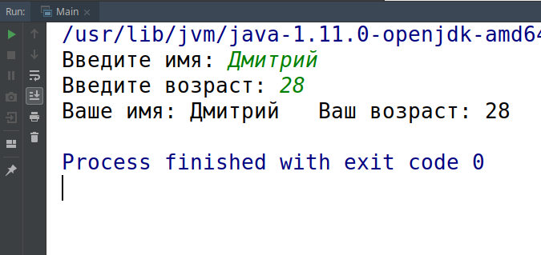
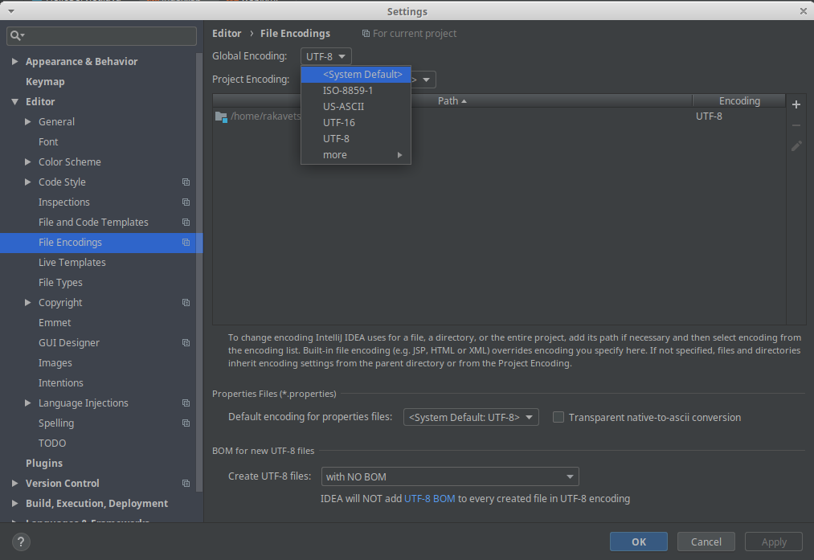

# Консольный ввод и вывод

1. [Консольный вывод](#Консольный-вывод) 
2. [Консольный ввод](#Консольный-ввод) 
3. [Проблема с кириллическими символами](#Проблема-с-кириллическими-символами) 

Для получения данных, введенных пользователем, а также для вывода сообщений нам необходим ряд классов, через которые мы сможем взаимодействовать с консолью.  Для взаимодействия с консолью нам необходим класс `System`. Этот класс располагается в пакете `java.lang`, который автоматически подключается в программу, поэтому нам не надо дополнительно импортировать данный пакет и класс.

## Консольный вывод
Для создания потока вывода в класс `System` определен объект `out`. В этом объекте определен метод `println`, который позволяет вывести на консоль некоторое значение с последующим переводом консоли на следующую строку:
```java
System.out.println("Hello world");
```

В метод `println` передается любое значение, как правило, строка, которое надо вывести на консоль. При необходимости можно и не переводить курсор на следующую строку. В этом случае можно использовать метод `System.out.print()`, который аналогичен `println` за тем исключением, что не осуществляет перевода на следующую строку.
```java
System.out.print("Hello world");
```

Но с помощью метода `System.out.print` также можно осуществить перевод каретки на следующую строку. Для этого надо использовать `escape`-последовательность `\n`:
```java
System.out.print("Hello world \n");
```

Если у нас есть два числа, и мы хотим вывести их значения на экран, то мы можем, например, написать так:
```java
int x = 5;
int y = 6;
System.out.println("x=" + x + "; y=" + y);
```

Но в **Java** есть также функция для форматированного вывода, унаследованная от языка **С**: `System.out.printf()`. С ее помощью мы можем переписать предыдущий пример следующим образом:
```java
int x = 5;
int y = 6;
System.out.printf("x=%d; y=%d \n", x, y);
```

В данном случае символы `%d` обозначают спецификатор, вместо которого подставляет один из аргументов. Спецификаторов и соответствующих им аргументов может быть множество. В данном случае у нас только два аргумента, поэтому вместо первого `%d` подставляет значение переменной `x`, а вместо второго - значение переменной `y`. Сама буква `d` означает, что данный спецификатор будет использоваться для вывода целочисленных значений типа `int`.

Кроме спецификатора `%d` мы можем использовать еще ряд спецификаторов для других типов данных:
- `%x`: для вывода шестнадцатеричных чисел
- `%f`: для вывода чисел с плавающей точкой
- `%e`: для вывода чисел в экспоненциальной форме, например, `1.3e+01`
- `%c`: для вывода одиночного символа
- `%s`: для вывода строковых значений

Например:
```java
String name = "Иван";
int age = 30;
float height = 1.7f;         
System.out.printf("Имя: %s   Возраст: %d лет   Рост: %.2f метров \n", name, age, height);
```

При выводе чисел с плавающей точкой мы можем указать количество знаков после запятой, для этого используем спецификатор на `%.2f`, где `.2` указывает, что после запятой будет два знака. В итоге мы получим следующий вывод:
```
Имя: Иван   Возраст: 30 лет   Рост: 1,70 метров
```

## Консольный ввод
Для получения консольного ввода в классе `System` определен объект `in`. Однако непосредственно через объект `System.in` не очень удобно работать, поэтому, как правило, используют класс `Scanner`, который, в свою очередь использует `System.in`. Например, создадим маленькую программу, которая осуществляет ввод чисел:
```java
import java.util.Scanner;
 
public class FirstApp {
    public static void main(String[] args) {
        Scanner in = new Scanner(System.in);
        int[] nums = new int[5];
        for (int i = 0; i < nums.length; i++) {
            nums[i] = in.nextInt();
        }
         
        for (int i = 0; i < nums.length; i++) {
            System.out.print(nums[i]);
        }
        System.out.println();
    }   
}
```

Так как класс `Scanner` находится в пакете `java.util`, то мы вначале его импортируем. Для создания самого объекта `Scanner` в его конструктор передается объект `System.in`. После этого мы можем получать вводимые значения. Например, чтобы получить введенное число, используется метод `in.nextInt();`, который возвращает введенное с клавиатуры целочисленное значение.

В данном случае в цикле вводятся все элементы массива, а с помощью другого цикла все ранее введенные элементы массива выводятся в строчку.

Класс `Scanner` имеет еще ряд методов, которые позволяют получить введенные пользователем значения:
- `next()`: считывает введенную строку до первого пробела
- `nextLine()`: считывает всю введенную строку
- `nextInt()`: считывает введенное число int
- `nextDouble()`: считывает введенное число double
- `hasNext()`: проверяет, было ли введено слово
- `hasNextInt()`: проверяет, было ли введено число int
- `hasNextDouble()`: проверяет, было ли введено double

Кроме того, класс `Scanner` имеет еще ряд методов `nextByte/nextShort/nextFloat/nextBoolean`, которые по аналогии с `nextInt` считывают данные определенного типа данных.

Создадим следующую программу для ввода информации о человеке:
```java
import java.util.Scanner;
 
public class FirstApp {
    public static void main(String[] args) {
        Scanner in = new Scanner(System.in);
        System.out.print("Введите имя: ");
        String name = in.nextLine();
        System.out.print("Введите возраст: ");
        int age = in.nextInt();
        System.out.println("Ваше имя: " + name + "   Ваш возраст: " + age);
    }   
}
```

Например, если бы мы запускали проект в **IntelliJ IDEA**, то это выглядело бы так:



## Проблема с кириллическими символами
Нередко при вводе кириллических символов отображаются некорректные символы. В прицнипе проблема касается не только кириллических символов, но символов ряда других кодировок, отличающихся от латиницы. В этом случае надо настроить кодировку. Для этого можно пойти двумя путями.

Первый способ заключается в выборе кодировке в самой IDE. Для этого перейдем в меню *File -> Setting* или hotkey `Ctrl+Alt+S`.

Нам откроется окно настроек проекта, где в самом низу нам надо выбрать вместо кодировки по умолчанию `UTF-8` кодировку `windows-1251`:
